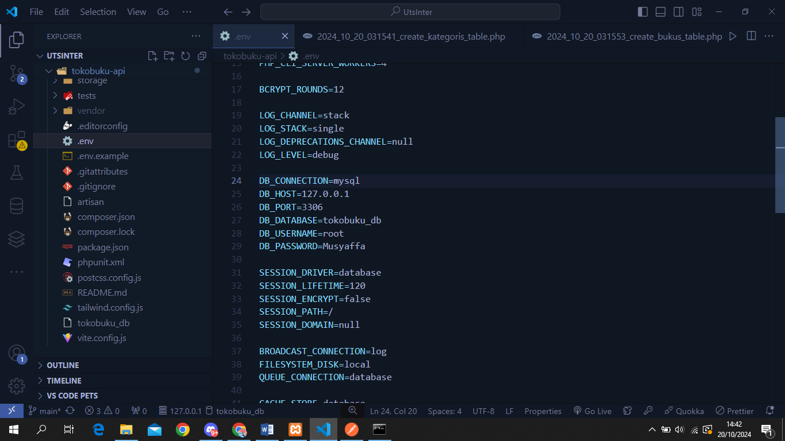
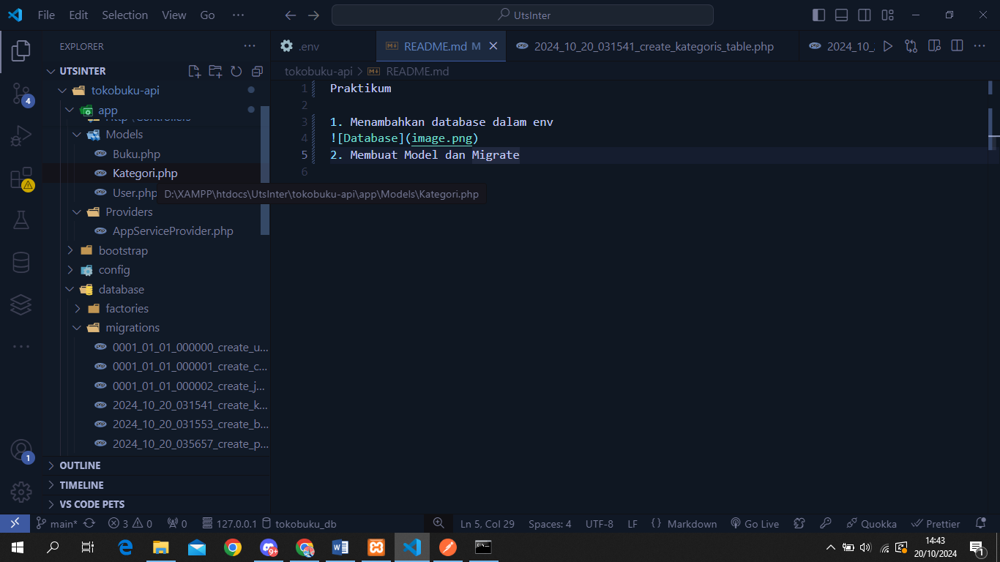
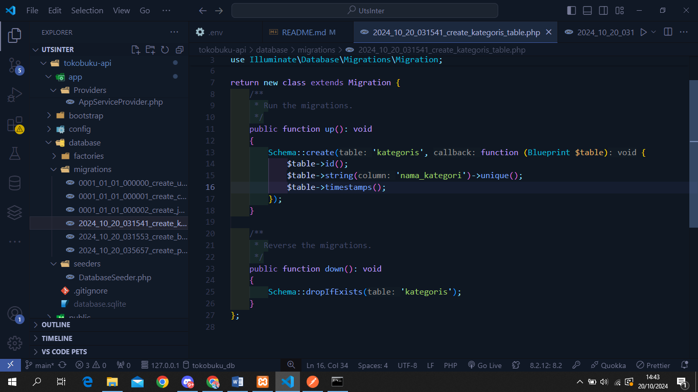
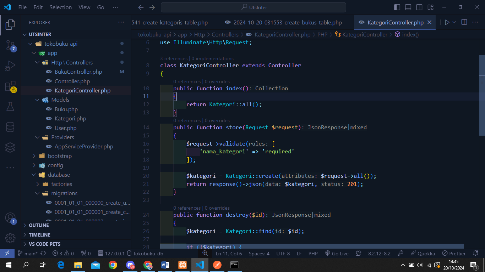
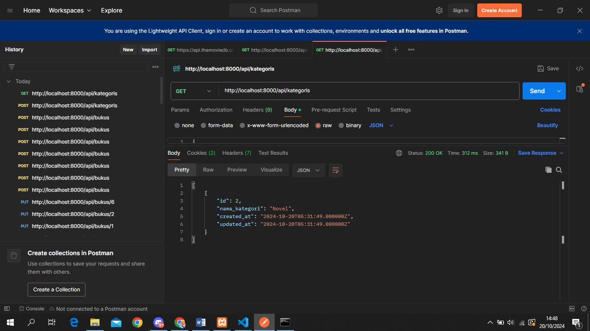
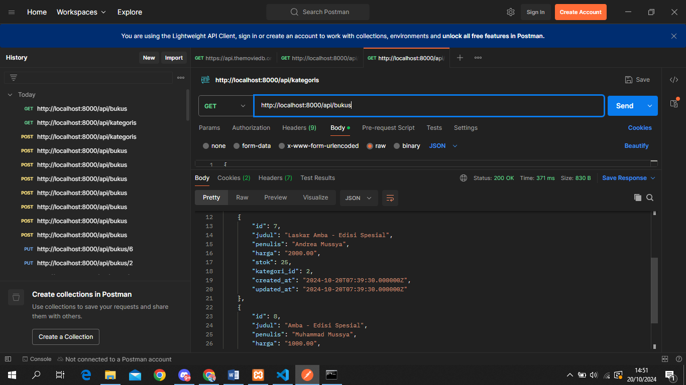

Praktikum

1. Menambahkan database dalam env
   
2. Membuat Model dan Migrate
   
3. Mengisi Table Kategoris dan bukus

Kategoris:

Bukus:

4. Membuat Buku dan Kategoris Controller dan Mengisi Controller

Kategoris:

Bukus:

5. Lalu menambahkan api.php dengan cara "php artisan install:api" agar config otomatis terinstall

Menambahkan Route Buku dan Kategori:

6. Mem-post dan melihat hasil dari kategoris

Hasil dari POST dan Melihat dengan GET:

7. Menambah dan Melihat hasil dari bukus
   
   \*ketika menambahkan buku, id dari ketagori harus sama
